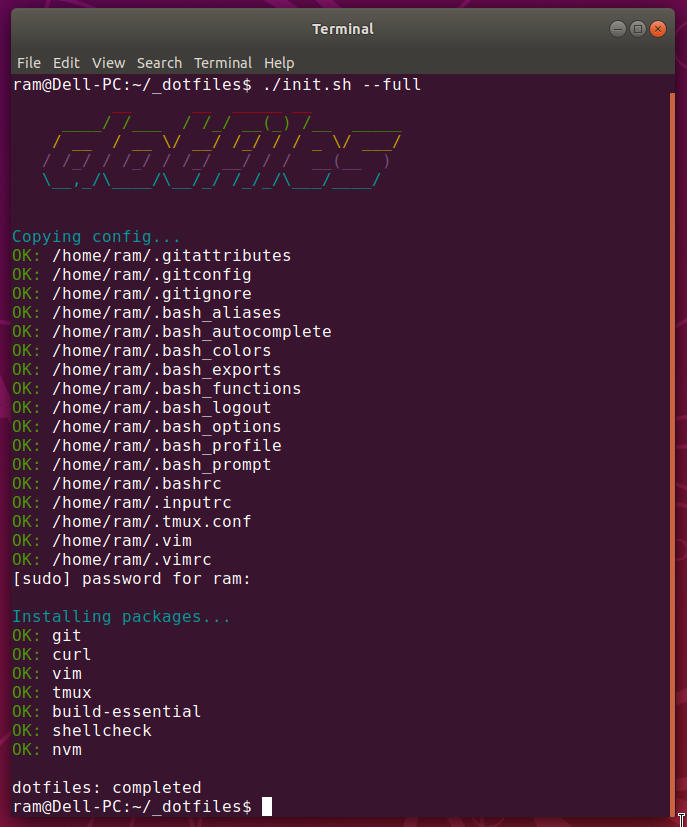
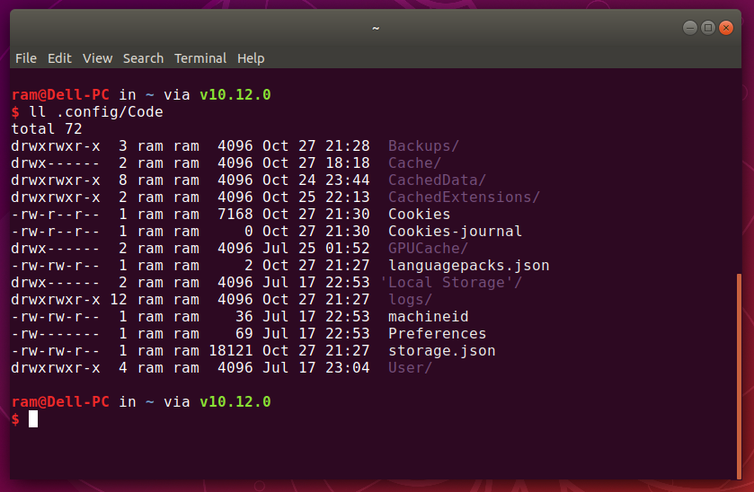
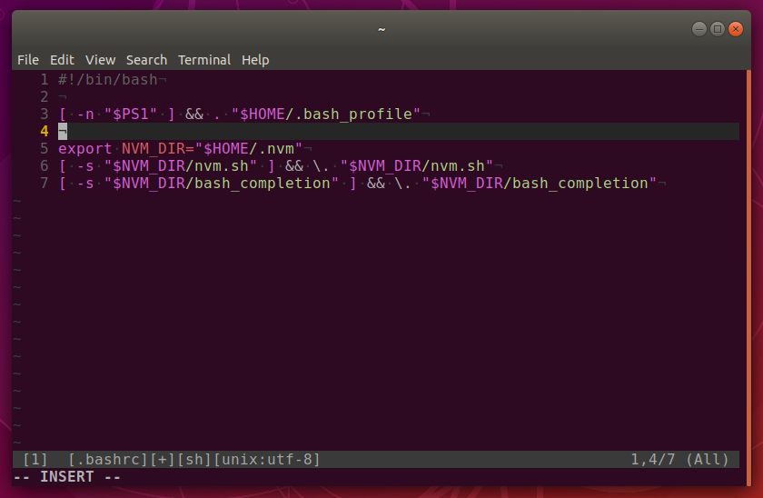
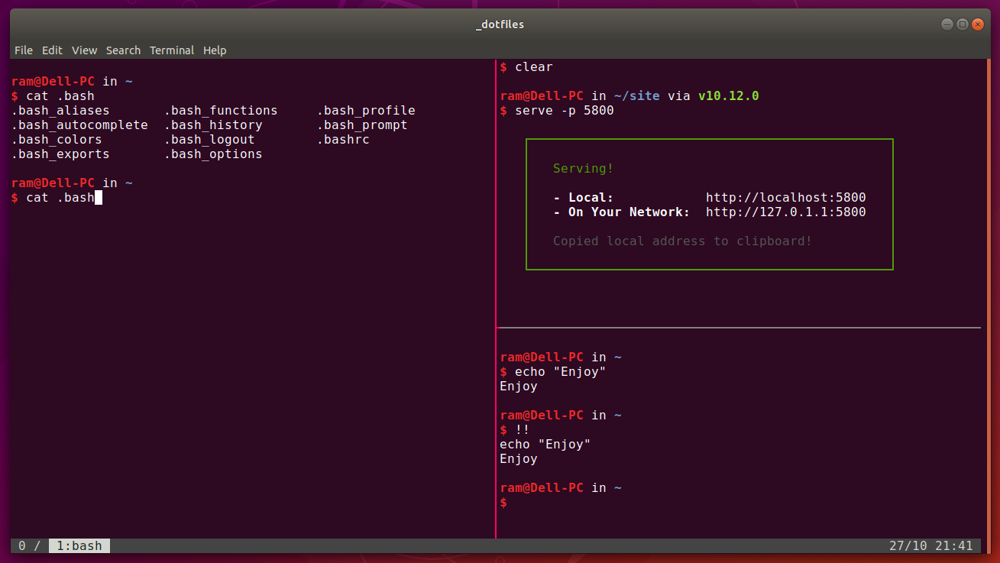

# _dotfiles
My dotfiles. A must, I think...

"Automation is not about being lazy, its about being productive" - [_Forgotten source_]

## Installation
``` bash
$ git clone https://github.com/r0mflip/_dotfiles.git
$ cd _dotfiles
$
$ ./init.sh
```

## Screenshots

### Installation
<table>
  <tbody>
    <tr>
      <td>
        
      </td>
    </tr>
    <tr align="center">
      <td>Installation</td>
    </tr>
  </tbody>
</table>

<table>
  <tbody>
    <tr>
      <td>
        
      </td>
      <td>
        
      </td>
    </tr>
    <tr align="center">
      <td>Terminal</td>
      <td>vim</td>
    </tr>
  </tbody>
</table>

### tmux
<table>
  <tbody>
    <tr>
      <td>
        
      </td>
    </tr>
    <tr align="center">
      <td>tmux</td>
    </tr>
  </tbody>
</table>

## Suggested colors
- Vim uses [one-dark](https://github.com/AlexMax/.vim/blob/master/colors/one.vim) theme by AlexMax
- [Snazzy](https://github.com/sindresorhus/hyper-snazzy) terminal theme by Sindre Sorhus
  - Use [colortool](https://github.com/Microsoft/console/tree/master/tools/ColorTool) on Windows
  - Use [gogh](https://github.com/Mayccoll/Gogh/) for Gnome Terminal

## Acknowledgements
Inspiration and code stolen from:

- [Cătălin Mariș dotfiles](https://github.com/alrra/dotfiles)
- [Mathias Bynens' dotfiles](https://github.com/mathiasbynens/dotfiles)
- [Paul Irish's dotfiles](https://github.com/paulirish/dotfiles)
- [Laxman's dotfiles](https://github.com/notlmn/.dotfiles)
- ... and other forgotten sources (¯\\\_(ツ)_/¯ sorry)

## License
[MIT](LICENSE)
